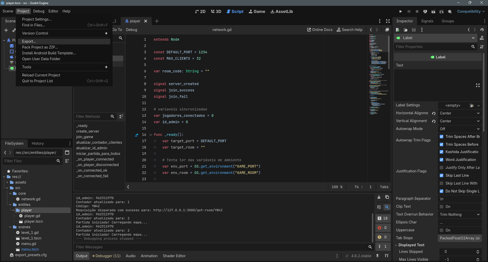
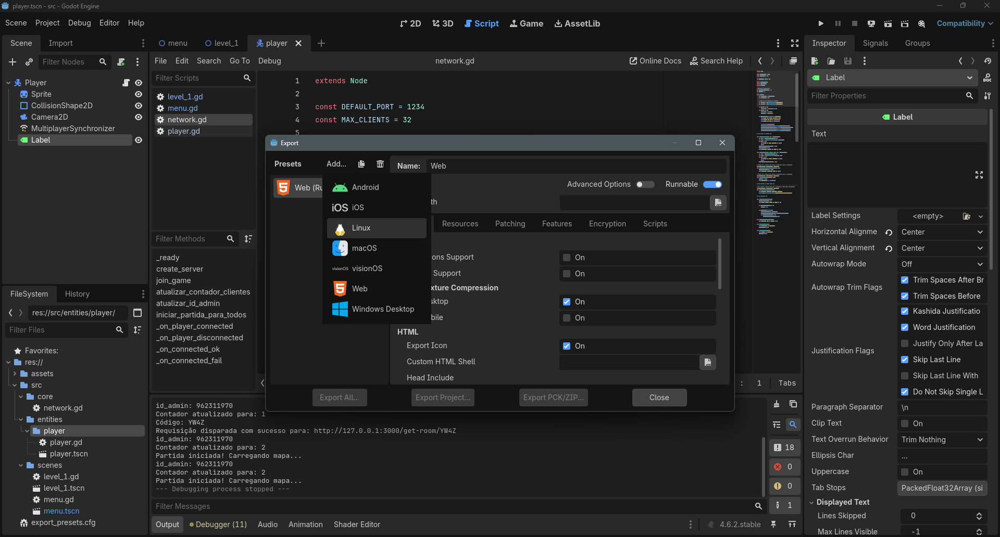
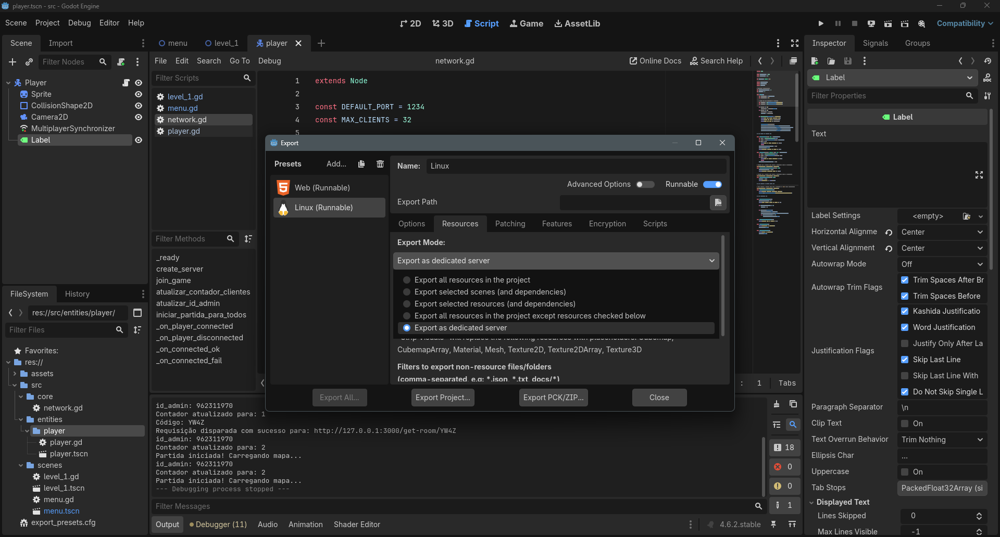
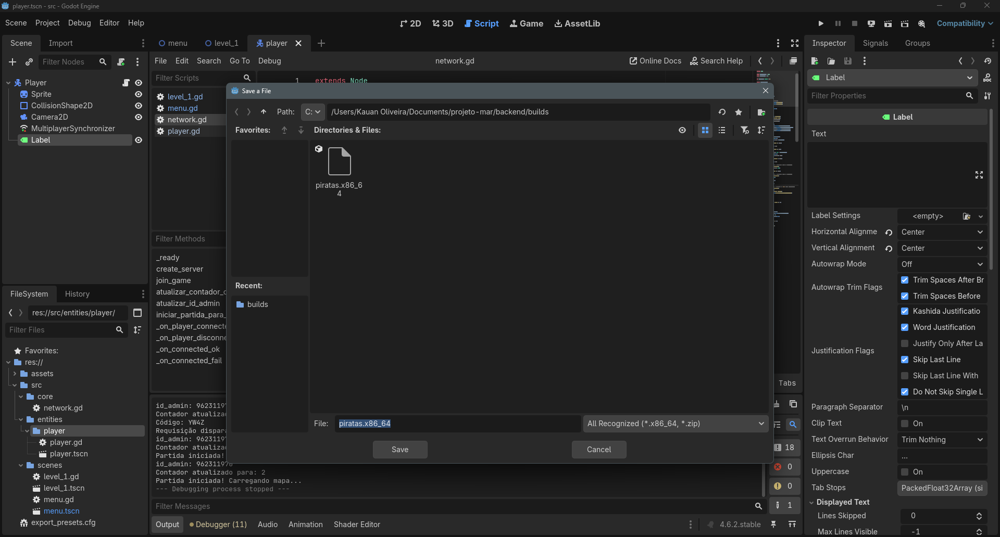
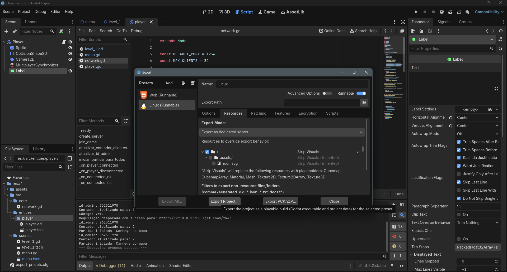
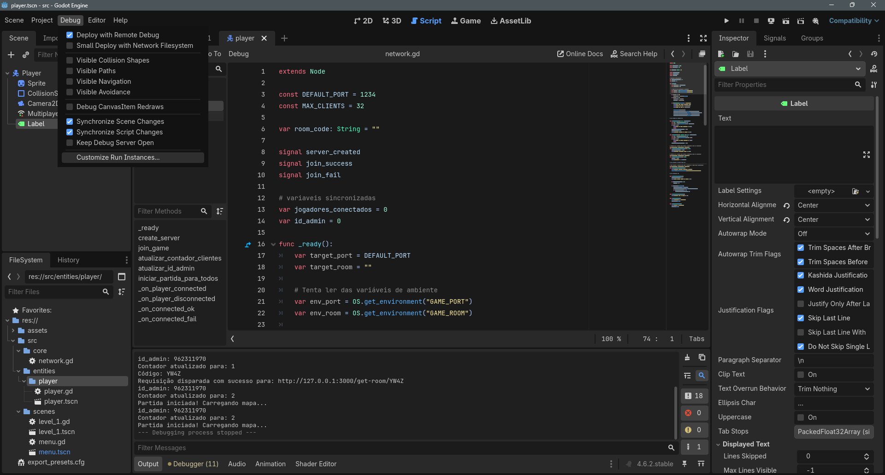
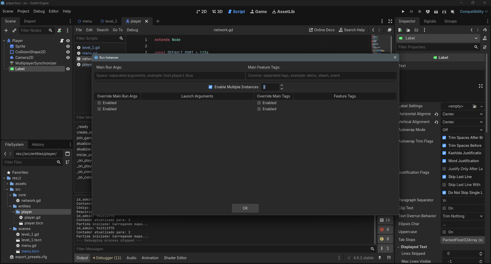

# Backend

## Configurações iniciais

### Instalar dependecias

para que funcione você primeiro deve instalar as dependencias (não deveria precisar por que a docker faz isso também, mas tá tendo um bug que ainda não sei como resolver)

```
npm ci
```

### Exportar projeto godot

você vai precisar abrir o godot e exportar o projeto como um servidor dedicado para Linux, siga o passo a passo abaixo:

1. vá em Project > Export 


2. na janela de exportação clique em add e selecione Linux 


3. vá para resources e em export mode selecione Export as dedicated server


4. clique em Export Path e vá até a pasta /backend/builds (caso a pasta não exista crie) e coloque o nome do arquivo como piratas.x86_64


5. clique em Export Project... (talvez antes seja preciso baixar algumas dependecias se aparecer uma mensagem vermelha e não tiver sendo possivel clicar no botão)


### Rodar docker

se tudo deu certo nos passos anteriores pasta você executar:

```
docker compose up --build
```

espere a docker iniciar, ela estará pronta quando aparecere a mensagem Orquestrador rodando na porta 3000

### Rodar instancias godot

para testar o jogo é necessário dois player na mesma sala para isso configure para o godot rodar duas instancias clientes

1. clique em Debug > Customize Run Instaces


1. habilite Enable Multiple Instaces e digite o valor 2 na caixa da direita


1. por fim execute o projeto